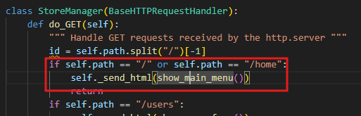
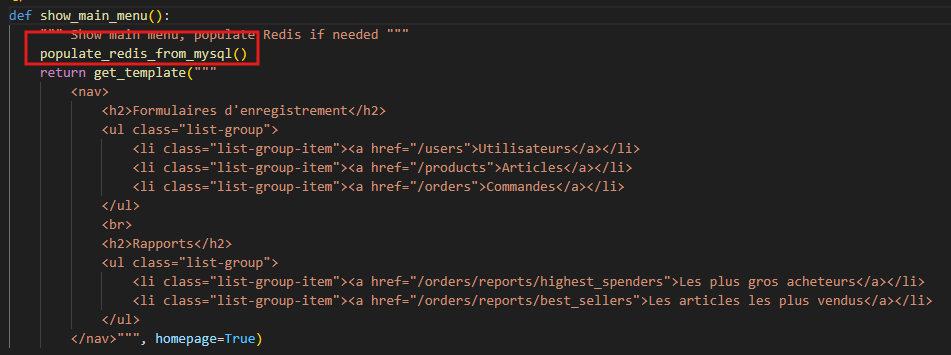
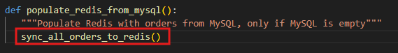
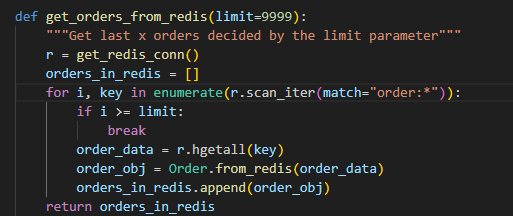
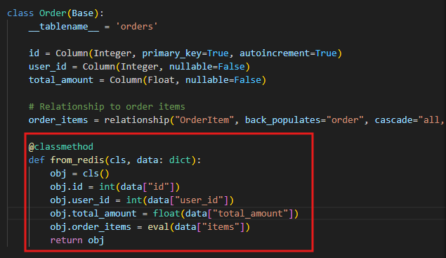

# Labo 02 — Rapport

 \
[Jean-Christophe Benoit] \
Rapport de laboratoire \
LOG430 — Architecture logicielle \
Montréal, le 25 septembre 2025 \
École de technologie supérieure

> J'ai crée ce PDF en utilisant le gabarit markdown (.md).

## Questions

### Question 1

> Lorsque l'application démarre, la synchronisation entre Redis et MySQL est-elle initialement déclenchée par quelle méthode ? Veuillez inclure le code pour illustrer votre réponse.

La synchronisation entre Redis et MySQL est initialement déclenchée par une requête HTTP GET reçu sur la route '/' ou '/home' par notre API définit dans `store_manager.py` qui exécute la méthode `show_main_menu` du `template_view.py` qui elle exécute la méthode `populate_redis_from_mysql` du `order_controller.py`, qui elle finalement exécute `sync_all_orders_to_redis` du fichier `write_order.py`.\

_store_manager.py_\

_template_view.py_\

_order_controller.py_\

Dans notre cas, nous voulons seulement exécuter `sync_all_orders_to_redis`, donc j'ai ajouté un appel à cette fonction lors du démarrage de l'application dans `store_manager.py` et j'ai enlever les appels de méthodes mentionnés plus haut.

### Question 2

> Quelles méthodes avez-vous utilisées pour lire des données à partir de Redis ? Veuillez inclure le code pour illustrer votre réponse.

J'ai utilisé les méthodes `scan_iter`, `hgetall` et une méthode custom `from_redis` que j'ai ajouté à la classe `Order` pour pouvoir lire les données de Redis. `scan_iter` pour permettre de mettre une limite sur le nombre de données qu'on veut lire afin de réduire la latence. `hgetall` car j'ai décidé de stocker les commandes en tant que hash pour suivre les meilleurs pratiques de Redis pour les données structurées. Et finalement, la méthode custom pour que le code soit plus lisible.

_read_order.py_\

_order.py_\

### Question 3

Votre réponse ici (ajoutez des illustrations si nécessaire : captures d’écran, extraits de code, etc.)

## Observations additionnelles

- Observations sur d’éventuels problèmes de setup ou de code rencontrés lors de l’exécution des activités (optionel).
- Particularités de votre configuration CI/CD (ex. : utilisation d’une VM, d’un service infonuagique comme Azure, etc.).
