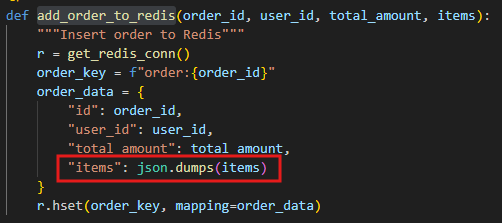

# Labo 02 — Rapport

 \
[Jean-Christophe Benoit] \
Rapport de laboratoire \
LOG430 — Architecture logicielle \
Montréal, le 25 septembre 2025 \
École de technologie supérieure

> J'ai crée ce PDF en utilisant le gabarit markdown (.md).

## Questions

### Question 1

> Lorsque l'application démarre, la synchronisation entre Redis et MySQL est-elle initialement déclenchée par quelle méthode ? Veuillez inclure le code pour illustrer votre réponse.

La synchronisation entre Redis et MySQL est initialement déclenchée par une requête HTTP GET reçu sur la route '/' ou '/home' par notre API définit dans `store_manager.py` qui exécute la méthode `show_main_menu` du `template_view.py` qui elle exécute la méthode `populate_redis_from_mysql` du `order_controller.py`, qui elle finalement exécute `sync_all_orders_to_redis` du fichier `write_order.py`.\

_store_manager.py_\

_template_view.py_\

_order_controller.py_\

Dans notre cas, nous voulons seulement exécuter `sync_all_orders_to_redis`, donc j'ai ajouté un appel à cette fonction lors du démarrage de l'application dans `store_manager.py` et j'ai enlever les appels de méthodes mentionnés plus haut. De plus, j'ai implémenté la fonction `add_order_to_redis` qui est appelé lors de la synchronisation :

_write_order.py_\

### Question 2

> Quelles méthodes avez-vous utilisées pour lire des données à partir de Redis ? Veuillez inclure le code pour illustrer votre réponse.

J'ai utilisé les méthodes `scan_iter`, `hgetall` et une méthode custom `from_redis` que j'ai ajouté à la classe `Order` pour pouvoir lire les données de Redis. `scan_iter` pour permettre de mettre une limite sur le nombre de données qu'on veut lire afin de réduire la latence. `hgetall` car j'ai décidé de stocker les commandes en tant que hash pour suivre les meilleurs pratiques de Redis pour les données structurées. Et finalement, la méthode custom pour que le code soit plus lisible.

_read_order.py_\

_order.py_\

### Question 3

> Quelles méthodes avez-vous utilisées pour ajouter des données dans Redis ? Veuillez inclure le code pour illustrer votre réponse.

Juste après le `session.commit()` dans la méthode `add_order`, j'ai simplement appelé la fonction `add_order_to_redis` que j'avais déjà implémenté dans le cadre de l'étape **1. Population initiale de Redis au démarrage**. Dans cette méthode, j'utilise la méthode `hset` pour ajouter une commande à Redis, c'est une bonne façon d'insérer des données structurées.

_write_order.py_\

### Question 4

> Quelles méthodes avez-vous utilisées pour supprimer des données dans Redis ? Veuillez inclure le code pour illustrer votre réponse.`

Après avoir commit la suppression SQL, j'appelle la fonction `delete_order_from_redis` qui est implémenté en utilisant la méthode `delete` de Redis pour supprimer la clé de la commande et tout son contenu :

_write_order.py_\

### Question 5

> Si nous souhaitions créer un rapport similaire, mais présentant les produits les plus vendus, les informations dont nous disposons actuellement dans Redis sont-elles suffisantes, ou devrions-nous chercher dans les tables sur MySQL ? Si nécessaire, quelles informations devrions-nous ajouter à Redis ? Veuillez inclure le code pour illustrer votre réponse.

Pour créer un rapport présentant les produits les plus vendus, nous aurions besoin de récupérer le nom du produit de la base de données MySQL, car les données par rapport aux produits sont sauvegardé dans Redis, mais seulement le ID de chaque produit :

_write_order.py_\

Dans mon cas, la fonction `get_orders_from_redis` de `read_order.py` avec quelques manipulations de liste et des requête vers MySQL pour obtenir le nom de chaque produit me serait suffisant pour générer ce rapport :

_read_order.py_\

_report_view.py_\

Cependant, j'ai aussi implémenté le code pour générer ce rapport en utilisant, au préalable, la méthode `incr` pour garder une trace au fur et à mesure que les commandes se font. Cette façon de faire, ajoute une requête à MySQL lors de l'ajout d'une commande, mais permet une génération de rapport plus rapide :

_write_order.py_\

_write_product.py_\

_read_product.py_\

## Observations additionnelles

**Configuration CI/CD**

Le workflow de GitHub Actions s'exécute sur un self hosted runner qui se trouve sur la machine virtuelle de l'école.

La pipeline de CI met en place les services MySQL et Redis, installe les dépendances, et exécute les tests python.

Ensuite, l'application est déployée à l'aide de `docker compose` et elle est accessible via l'adresse IP de ma machine virtuelle (10.) au port 5000

> **Note** : Le VPN Cisco Secure Client doit être activé et connecté à accesvpn.etsmtl.ca pour accéder à l'application déployé

**Problèmes rencontrés**

- Les fonctions Redis n'était pas facile à trouver et c'était difficile de comprendre ce que chacune des fonction Redis font.
